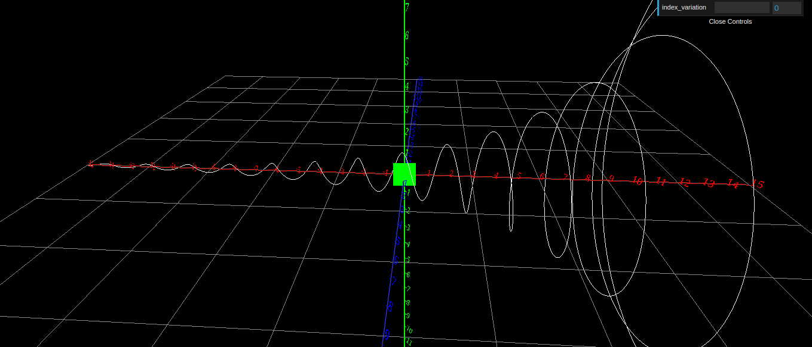

# i-graph

Funções como f(x) = (-1)^x podem gerar como resultado números complexos para determinados valores de x. Pensando no entendimento de tais funções, estou desenvolvendo um projeto que facilite a visualização de seus gráficos.
O projeto está em andamento, mas, já é possível observar algumas funções.

Eis a função f(x) = (-1.2)^x:
- Eixo vermelho: valores para X
- Eixo azul: parte real do número complexo da f(x)
- Eixo verde: parte imaginária do número complexo da f(x)
- O gráfico está com a cor branca.

